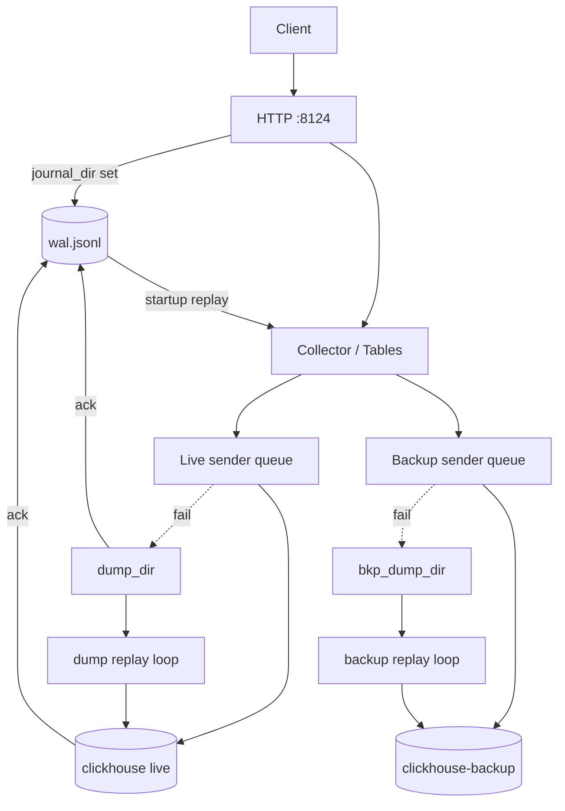

# Live / backup dual-write

Fork extension on top of [clickhouse-bulk](https://github.com/nikepan/clickhouse-bulk): one HTTP endpoint batches INSERTs and delivers them to one or two ClickHouse targets.

## Architecture



- **One collector** batches by query key (`params` + `query`).
- **Two senders** (when backup enabled): separate queues, workers, dumps, metrics.
- **Non-INSERT** queries go to **live only**.

## Dual-write flow

1. Batch flushed from memory.
2. Enqueued to **live** sender.
3. Same batch copied to **backup** sender (async).
4. Each worker POSTs to its server pool; failures go to the matching `dump_dir`.

There is **no rollback** between targets. See [typical outcomes](#typical-outcomes).

Enable backup via `clickhouse-backup` in JSON or `CLICKHOUSE_BACKUP_SERVERS`.

## Journal (durable HTTP accept)

Optional: set `journal_dir` (e.g. `journal`). Disabled when empty.

### Purpose

Clients get HTTP `200` only after the row is on **local disk** in the WAL. The row is then loaded into the collector and delivered to live (and backup if enabled).

### Files

| File | Role |
|------|------|
| `journal_dir/wal.jsonl` | Append-only JSON lines: `id`, `params`, `content` |
| `journal_dir/ack.jsonl` | Acknowledged IDs (compacted with WAL) |

### When is a journal entry acked?

On the **live path only**, when the batch is durably stored:

- successful POST to live ClickHouse, **or**
- successful write to live `dump_dir` (including `failed/` for 4xx).

Backup dumps do **not** gate journal ack: once live has accepted or dumped, the WAL line can be removed. Backup recovery uses `bkp_dump_dir`.

### Lifecycle

1. `Append` → WAL line → HTTP `200` → `Push` to collector.
2. Flush → live queue → send or dump → `Ack` → `Compact` shrinks WAL.
3. Crash → on start, `ReplayUnacked` pushes pending WAL lines into collector.

### Disk and limits

- WAL grows while rows are not yet sent **or** dumped on live.
- `max_journal_pending`: refuse new inserts with HTTP **503** when backlog is full.
- `journal_fsync`: `fsync` per append (safer, slower).
- Metrics: `ch_journal_pending`, `ch_journal_dir_bytes` (only if journal enabled).

## Send rate limit

Per target in `clickhouse` / `clickhouse-backup`:

- `send_max_rps` — sustained POSTs per second to ClickHouse.
- `send_max_burst` — short burst capacity.

Applied in `SendQuery` (queue worker **and** dump replay). `0` = unlimited.

Use when ingest outpaces ClickHouse: slows delivery, keeps journal backlog under control together with `max_journal_pending`.

## Dumps

| Prefix in filename | Meaning | Replay |
|--------------------|---------|--------|
| `1` | Transient / 5xx / network | Yes, via queue rate limit |
| `2` | Client error 4xx | No → moved to `failed/` |

**Manual replay** (after fixing schema / params on ClickHouse):

```bash
# live failed dumps (default)
curl -X POST 'http://127.0.0.1:8124/debug/replay-failed'

# backup only, or both targets
curl -X POST 'http://127.0.0.1:8124/debug/replay-failed?target=backup'
curl -X POST 'http://127.0.0.1:8124/debug/replay-failed?target=all&limit=10'
```

Response JSON: `status`, `live` / `backup` with `sent`, `errors`, `remaining`, per-file `items`.
`GET` is supported as well. Files are deleted on successful send; failures stay in `failed/`.

| Setting | Effect |
|---------|--------|
| `dump_check_interval` | Live replay tick (seconds) |
| `bkp_dump_check_interval` | Backup replay tick (`0` = same as live) |
| `dump_replay_batch` | Max files per tick per target |
| `max_dump_files` | Prune oldest pending `.dmp` when over limit |

Metrics: `ch_dump_dir_bytes`, `ch_bkp_dump_dir_bytes`, `ch_queued_dumps`, `ch_bkp_queued_dumps`.

## Graceful shutdown

SIGINT/SIGTERM:

1. Stop HTTP listener.
2. `SafeQuit`: flush collector, drain live (+ backup) queues.
3. Timeout: `shutdown_drain_sec`.

## What is guaranteed

- **At-least-once** per target (with retries via dumps).
- With journal: `200` ⇒ row in WAL until live CH or live dump.
- Graceful shutdown drains in-memory data and queues (within timeout).

## What is not guaranteed

- Live ≡ backup at every instant.
- Backup success if live already acked journal but backup is down (use `bkp_dump_dir` + alerts).
- Synchronous replication or exactly-once to ClickHouse.

## Typical outcomes

| Situation | Outcome |
|-----------|---------|
| Live OK, backup down | Data on live; backup catches up from `bkp_dump_dir` |
| Live down → live dump | WAL acked; replay from `dump_dir` when live returns |
| Live OK, backup 4xx | Live OK; `bkp_dump_dir/failed/` — fix `query_params` / schema |
| High ingest, slow CH | Journal + queue grow; use `send_max_rps`, `max_journal_pending` |

## Backup query parameters

`clickhouse-backup.query_params` — appended to every backup URL, e.g. `database=standby`.

## Configuration

See [CONFIG.md](./CONFIG.md). Precedence: defaults → JSON → env.

## Monitoring

See [ALERTS.md](./ALERTS.md).

## Operational risks

See [RISKS.md](./RISKS.md) for live-only (journal on/off) and live+backup risk matrices and checklists.
