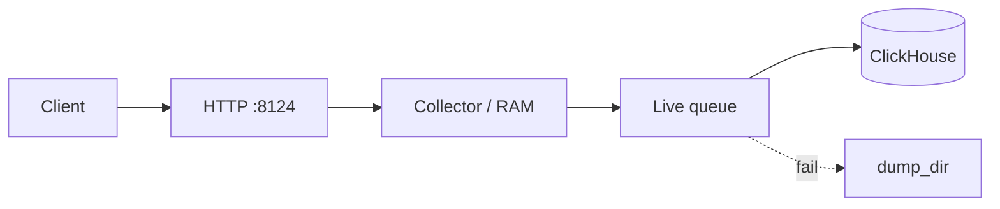
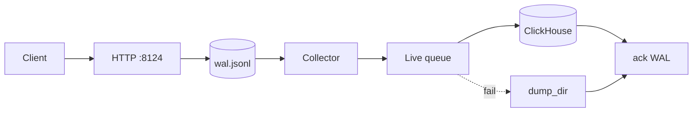
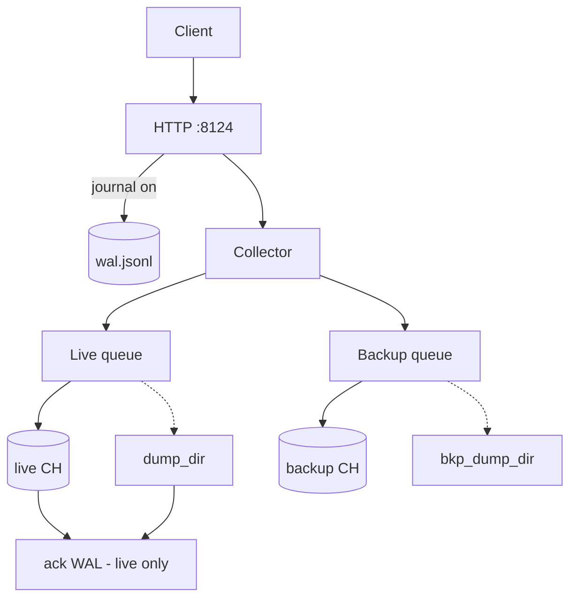
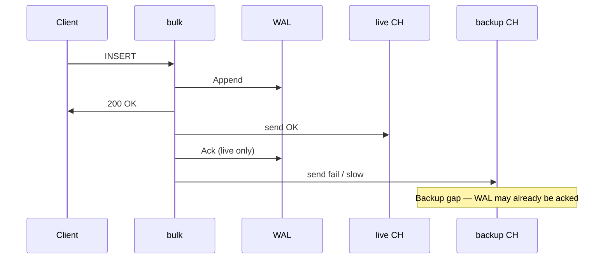

# Operational risks

This document describes **what can go wrong** in each deployment mode and how to mitigate it. It complements [DUAL_WRITE.md](./DUAL_WRITE.md) (semantics) and [ALERTS.md](./ALERTS.md) (metrics).

**Severity legend**

| Label | Meaning |
|-------|---------|
| **Impact** | What you lose or how bad the outage is |
| **Likelihood** | Typical probability in production if not mitigated |

Guarantees are **per target** (live and backup are independent). See [What is not guaranteed](./DUAL_WRITE.md#what-is-not-guaranteed) in DUAL_WRITE.md.

---

## Mode overview

| Mode | Config | HTTP `200` means |
|------|--------|------------------|
| **Live only, journal off** | `journal_dir` empty; no `clickhouse-backup` | Batch accepted into **memory** (collector) |
| **Live only, journal on** | `journal_dir` set; no backup | Row on **disk (WAL)** before `200`; ack when on live CH or live `dump_dir` |
| **Live + backup** | `clickhouse-backup` + optional journal | Same journal rules as live-only; backup is **not** gated by journal ack |

Samples: [config.sample.json](../config.sample.json) (live + journal), [config.sample-backup.json](../config.sample-backup.json) (dual-write).

---

## Live only — journal **off**

Legacy upstream behavior. No WAL; fastest path, weakest durability before ClickHouse.

### Architecture (risks in context)

### Risks

| Risk | Impact | Likelihood | Notes |
|------|--------|------------|-------|
| **Process crash after `200`** | Data only in RAM is **lost** | Medium under load / OOM / `kill -9` | No replay from disk for unflushed batches |
| **OOM / memory pressure** | Ingest stall or crash; loss of in-memory tables | Medium with high `flush_count` / many query keys | One table per distinct `params` key |
| **At-least-once / duplicates** | Duplicate rows in ClickHouse | Medium | Dump replay, timeouts (CH accepted, bulk saw error) |
| **5xx / network → dumps** | Delayed delivery; disk use | Medium | Prefix `1` files replayed automatically |
| **4xx → `failed/`** | Rows not in CH until manual fix + `/debug/replay-failed` | Low–medium after schema changes | Journal N/A; client already got `200` |
| **`max_dump_files` prune** | **Permanent loss** of oldest **pending** `.dmp` | Low if limit set carelessly | Does not prune `failed/` |
| **Disk full on `dump_dir`** | Sends fail; dumps may fail; data stuck in queue/RAM | Low | Monitor `ch_dump_dir_bytes` |
| **Single bulk instance (SPOF)** | Ingest stops for live | Medium | Dumps survive restart; RAM does not |
| **Unauthenticated `/debug/*`** | Abuse if port exposed | Low on internal network | See [Debug endpoints](#debug-endpoints) |

### Mitigations

- Use when you accept **best-effort** ingest: clients retry, or data is non-critical.
- Prefer **journal on** for anything you cannot re-send from source.
- Alerts: `ch_good_servers`, `ch_send_queue`, `ch_queued_dumps`, `ch_dump_dir_bytes` ([ALERTS.md](./ALERTS.md)).
- Graceful shutdown: `shutdown_drain_sec`; avoid `kill -9` under load.

---

## Live only — journal **on**

Durable HTTP accept: `200` only after append to `journal_dir/wal.jsonl`. Recovery on startup via `ReplayUnacked`.

### Architecture (risks in context)

### What journal does and does not do

| Does | Does not |
|------|----------|
| Survive bulk **restart** for unacked WAL lines | Guarantee row is **inside** ClickHouse at `200` time |
| Refuse ingest at `max_journal_pending` (**503**) | Prevent duplicates on replay |
| Ack when live POST succeeds **or** live dump write succeeds (incl. `failed/` for 4xx) | Protect against **disk full** on journal path (append fails → **500**) |

### Risks

| Risk | Impact | Likelihood | Notes |
|------|--------|------------|-------|
| **`200` before ClickHouse** | Client may assume CH has row; only WAL + pipeline | By design | Ack is on live CH **or** live dump, not “committed merge” |
| **Journal disk full** | New inserts **500**; backlog stuck | Low–medium | `ch_journal_dir_bytes`, filesystem alerts |
| **`max_journal_pending` exceeded** | Ingest **503** (backpressure) | Medium if live slower than ingest | Tune `send_max_rps`, scale CH, reduce ingest |
| **`journal_fsync: false`** | Small window of lost WAL on crash/power loss | Low | Set `journal_fsync: true` for stricter durability (slower) |
| **Live dump write fails** | WAL **not** ack; journal grows | Low | Log: `dump failed, journal entries retained` |
| **Live 4xx → `dump_dir/failed/`** | WAL **acked**; row not in CH | Medium on bad schema | Fix CH, then `POST /debug/replay-failed` |
| **At-least-once / duplicates** | Duplicate rows | Medium | Journal replay + dump replay after crashes |
| **`max_dump_files` prune** | Loss of pending dumps | Low | Same as journal-off |
| **Crash after ack, before backup N/A** | — | — | Live-only: only live path matters |
| **SPOF bulk** | Ingest stop; WAL retained | Medium | Restart replays unacked WAL |

### Mitigations

- Default for **production live** when sources cannot cheaply replay.
- Monitor `ch_journal_pending`, `ch_journal_dir_bytes`; correlate with `ch_send_queue`.
- Separate volume/quota for `journal_dir` and `dump_dir`.
- After schema fix: replay `failed/` via [DUAL_WRITE.md](./DUAL_WRITE.md#dumps).

---

## Live + backup (dual-write)

One HTTP endpoint; **two** sender queues, two dump directories, optional shared journal (live-only ack).

### Architecture (risks in context)

### Core semantic risk: journal ≠ dual-write

| | |
|--|--|
| **Issue** | Journal ack follows **live** success or **live** dump only. Backup success/failure does **not** delay ack. |
| **Scenario** | Live OK → WAL ack. Backup down, queue backlog, or dumps → **silent standby gap**. |
| **Impact** | Operators see healthy journal / `200`; backup DR incomplete. |
| **Likelihood** | Medium on unstable standby or asymmetric rate limits. |

**Mitigation:** Treat journal as **live durability**, not “both clusters OK”. Alert on `ch_bkp_*`, compare row counts on both clusters, use `bkp_dump_dir` + `/debug/replay-failed?target=backup`.

### Risk: live ↔ backup divergence

| | |
|--|--|
| **Issue** | No cross-target transaction; `DualSender` enqueues live then backup (async). |
| **Scenarios** | Backup slow/down; different `query_params` / schema; different `send_max_rps`. |
| **Impact** | Standby lag or missing partitions; DR assumptions fail. |
| **Likelihood** | High with heterogeneous clusters; medium with “identical” schema. |

**Mitigation:** [ALERTS.md](./ALERTS.md) backup section; heuristic `ch_sent_count` vs `ch_bkp_sent_count`; authoritative checks on CH.

### Risk: at-least-once on **both** clusters

Duplicates on live **and** backup if both paths retry (dump replay, journal replay, HTTP timeouts).

**Mitigation:** Idempotent modeling in ClickHouse (version column, `ReplacingMergeTree`, downstream dedup).

### Risk: backup 4xx / schema drift

| | |
|--|--|
| **Issue** | Backup 4xx → `bkp_dump_dir/failed/`; no auto-retry. Live can be fully green. |
| **Impact** | Partial loss on standby only. |
| **Likelihood** | High at first connect; lower after schema parity. |

**Mitigation:** Migrate/validate backup before dual-write; alert `increase(ch_bkp_dump_count)`; inspect `bkp_dump_dir/failed/`; replay after fix.

### Risk: disk (journal + two dump trees)

| Component | Failure mode |
|-----------|----------------|
| `journal_dir` | Full → append **500** or **503** (pending limit) |
| `dump_dir` / `bkp_dump_dir` | Full → dump failures; live may retain WAL |
| `max_dump_files` | Deletes oldest **pending** `.dmp` only — **data loss** if misconfigured |

`failed/` subdirs are not auto-replayed and not pruned by `max_dump_files` the same way as pending files.

### Risk: load and backpressure

Double queues (~1000 each), double HTTP, double memory until flush. Asymmetric `send_max_rps` → backup always lags.

**Mitigation:** Align or intentionally limit backup RPS; scale bulk/CH; reduce `flush_count` or ingest rate.

### Risk: crash / shutdown

| Scenario | Live | Backup | Journal (if on) |
|----------|------|--------|-------------------|
| Kill after `200`, before flush | Replay from WAL on start | Same batch not yet enqueued | WAL retained |
| SIGTERM, drain timeout | Queue/dump state | Same | Partial drain |
| Live CH got batch, backup still in queue, hard kill | OK | **Possible gap** (not in dump yet) | May be acked if live already OK |

**Mitigation:** Adequate `shutdown_drain_sec`; graceful K8s termination; post-incident check `bkp_dump_dir` and metrics, not live alone.

### Risk: operational / infra

| Risk | Notes |
|------|-------|
| **SPOF** | One bulk process; failure stops ingest to both targets (on-disk state survives). |
| **SELECT/DDL** | Routed to **live only** — backup schema not updated via bulk. |
| **Metrics ≠ data equality** | `GET /status` and Prometheus show **queues**, not row-level parity. |
| **Debug endpoints** | No auth on `/debug/replay-failed`, pprof, etc. |

### Live + backup outcome matrix

| Event | Live | Backup | Journal (on) |
|-------|------|--------|--------------|
| Backup down, live OK | OK | `bkp_dump_dir` backlog | Ack after live OK |
| Live down, backup OK | `dump_dir` | May OK | Ack after **live** dump |
| Backup 4xx | OK | `bkp_dump_dir/failed/` | Ack if live OK |
| Live 4xx | `dump_dir/failed/` | May still receive batch | Ack after live → `failed/` |
| Journal disk full | Stalled | Stalled | `503` / `500` |
| `max_dump_files` on pending | Possible loss | Same on backup dir | Depends on live ack state |

### Live + backup checklist (before prod)

1. Backup schema (or deliberate diff) tested with real `query_params`.
2. Alerts on **live and backup** dumps, queues, servers; journal if enabled.
3. Runbook: `failed/` → fix → `POST /debug/replay-failed?target=live|backup|all`.
4. Periodic **row-level** reconciliation on CH, not only `ch_*_sent_count`.
5. Disk: `journal_dir`, `dump_dir`, `bkp_dump_dir` sized and monitored.
6. Duplicates accepted (at-least-once both sides).
7. DR expectation: standby = **best-effort async copy**, not synchronous CH replication.

---

## Cross-mode comparison

| Risk | Live, journal off | Live, journal on | Live + backup |
|------|-------------------|------------------|---------------|
| Loss on bulk crash (unflushed) | **Yes** (RAM) | **No** (WAL replay) | WAL protects **live accept** only |
| `200` before CH row | Yes (RAM) | Yes (WAL on disk) | Yes; backup may lag further |
| Standby / second target gap | N/A | N/A | **Primary risk** |
| Ingest stopped (disk / 503) | Dump dir | Journal + dumps | Journal + 2× dumps |
| Duplicates | Yes | Yes | Yes ×2 targets |
| 4xx dead letter | `dump_dir/failed/` | Same + WAL ack | + `bkp_dump_dir/failed/` |

---

## Debug endpoints

| Endpoint | Risk if exposed |
|----------|-----------------|
| `POST /debug/replay-failed` | Re-sends `failed/` batches to CH |
| `GET /debug/pprof/*` | Profiling / DoS surface |
| `GET /debug/gc`, `/debug/freemem` | Low direct data risk |

Bind `:8124` to internal networks or protect with reverse proxy auth.

---

## Related docs

- [DUAL_WRITE.md](./DUAL_WRITE.md) — architecture, journal lifecycle, dumps
- [ALERTS.md](./ALERTS.md) — Prometheus examples
- [CONFIG.md](./CONFIG.md) — all settings
- [ROADMAP.md](./ROADMAP.md) — resolved issues and optional follow-ups
